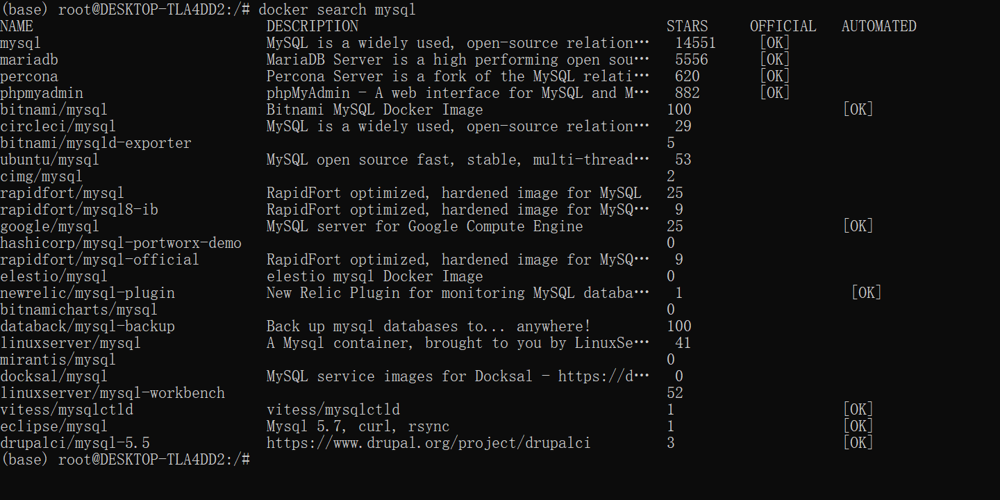
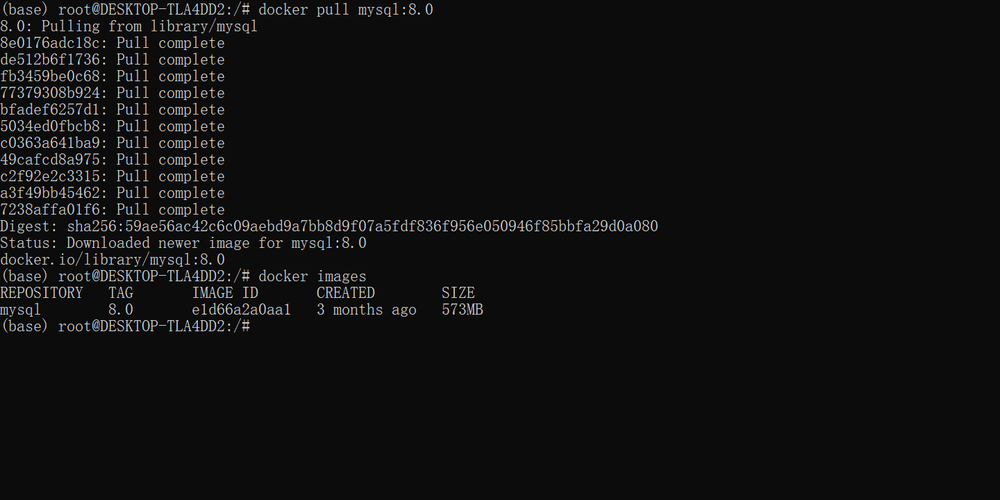
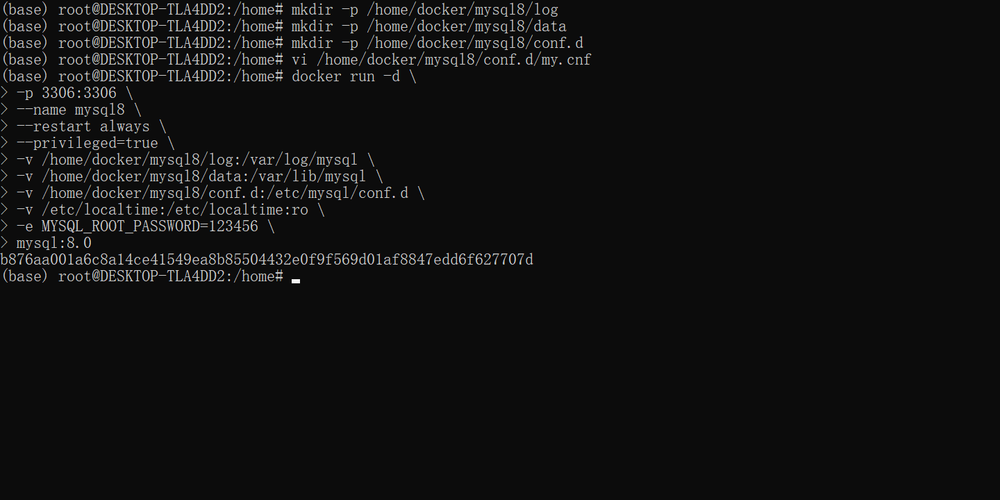
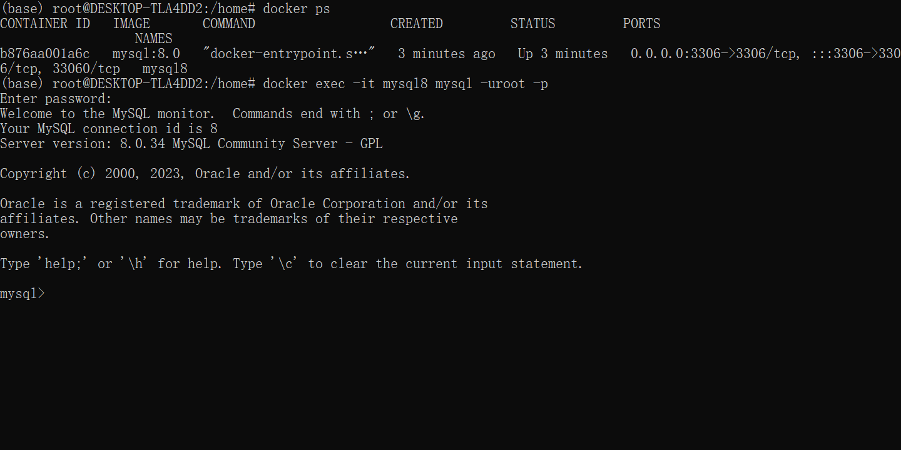
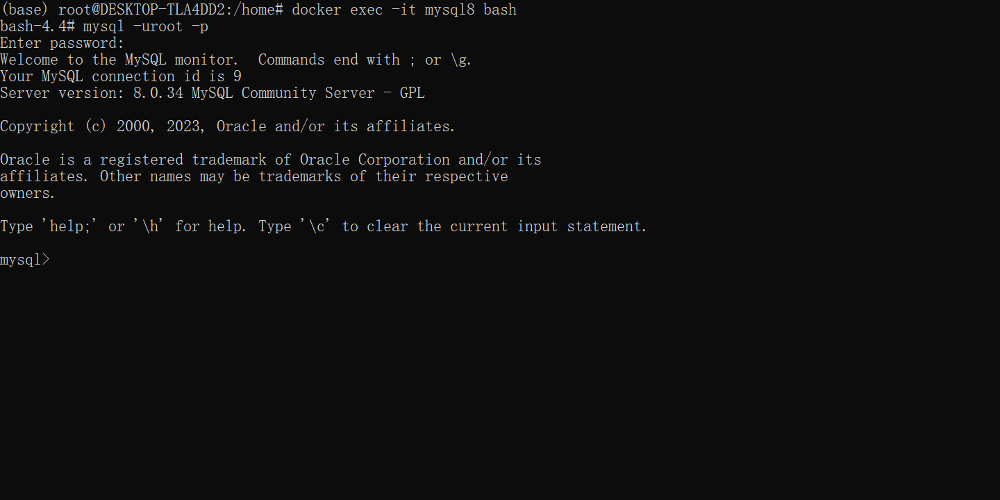
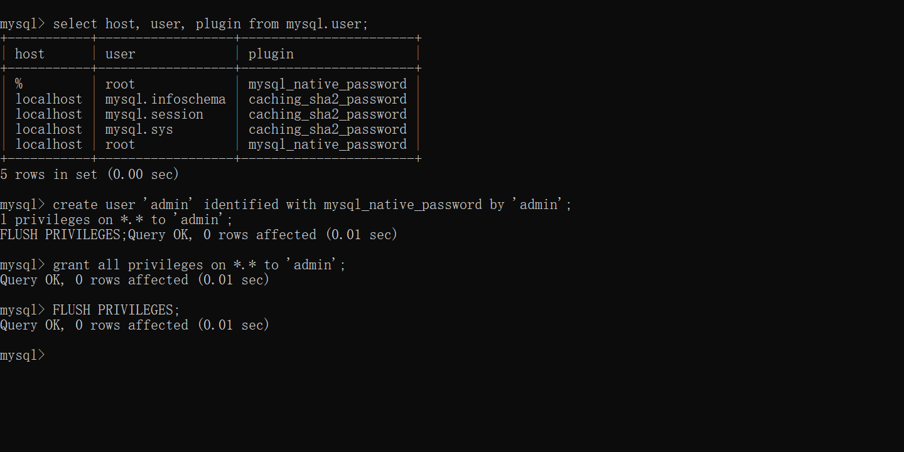

- [Docker进行安装教程](#docker进行安装教程)
  - [1. Mysql版本查询 \& Docker镜像下载](#1-mysql版本查询--docker镜像下载)
  - [2. 创建挂载目录](#2-创建挂载目录)
  - [3. 添加配置文件my.cnf](#3-添加配置文件mycnf)
  - [4. 启动 MySQL 服务器实例](#4-启动-mysql-服务器实例)
    - [4.1 参数说明](#41-参数说明)
  - [5. 连接 MySQL 服务器](#5-连接-mysql-服务器)
  - [6. 修改root密码 \& 启停以及删除 MySQL](#6-修改root密码--启停以及删除-mysql)
  - [7. 新增删除用户与权限](#7-新增删除用户与权限)
  - [8. 外部访问，检查防火墙](#8-外部访问检查防火墙)
  - [8.1 防火墙BUG问题](#81-防火墙bug问题)


# Docker进行安装教程 
- 服务器环境：ubuntu 20.04.6 LTS
- 其他安装方案：详见mysql-8.0-en手册
- 官网文档：[MySQL Documentation](https://docs.oracle.com/cd/E17952_01/index.html)
- Docker容器数据卷：[容器数据卷](https://blog.csdn.net/matrixlzp/article/details/130584835)

## 1. Mysql版本查询 & Docker镜像下载
- [官网查询： https://hub.docker.com](https://hub.docker.com)
```
docker search mysql
docker pull mysql:8.0
docker images
```



## 2. 创建挂载目录
```
mkdir -p /home/docker/mysql8/log
mkdir -p /home/docker/mysql8/data
mkdir -p /home/docker/mysql8/conf.d
```

## 3. 添加配置文件my.cnf 
- （没有特殊需求可以跳过）
这里需要给MySQL做点自定义的配置，比如时区字符编码等。
```
vi /home/docker/mysql8/conf.d/my.cnf
```
```
###### [mysql]配置模块 ######
[client]
default-character-set=utf8mb4
socket=/var/lib/mysql/mysql.sock

###### [mysql]配置模块 ######
[mysql]
# 设置MySQL客户端默认字符集
default-character-set=utf8mb4
socket=/var/lib/mysql/mysql.sock

###### [mysqld]配置模块 ######
[mysqld]
port=3306
user=mysql
# 设置sql模式 sql_mode模式引起的分组查询出现*this is incompatible with sql_mode=only_full_group_by，这里最好剔除ONLY_FULL_GROUP_BY
sql_mode=STRICT_TRANS_TABLES,NO_ZERO_IN_DATE,NO_ZERO_DATE,ERROR_FOR_DIVISION_BY_ZERO,NO_ENGINE_SUBSTITUTION
datadir=/var/lib/mysql
socket=/var/lib/mysql/mysql.sock
server-id = 1

# MySQL8 的密码认证插件 如果不设置低版本navicat无法连接
default_authentication_plugin=mysql_native_password

# 禁用符号链接以防止各种安全风险
symbolic-links=0

# 允许最大连接数
max_connections=1000

# 服务端使用的字符集默认为8比特编码的latin1字符集
character-set-server=utf8mb4

# 创建新表时将使用的默认存储引擎
default-storage-engine=INNODB

# 表名存储在磁盘是小写的，但是比较的时候是不区分大小写
lower_case_table_names=0
max_allowed_packet=16M 

# 设置时区
default-time_zone='+8:00'
```

## 4. 启动 MySQL 服务器实例
```
docker run -d \
-p 3306:3306 \
--name mysql8 \
--restart always \
--privileged=true \
-v /home/docker/mysql8/log:/var/log/mysql \
-v /home/docker/mysql8/data:/var/lib/mysql \
-v /home/docker/mysql8/conf.d:/etc/mysql/conf.d \
-v /etc/localtime:/etc/localtime:ro \
-e MYSQL_ROOT_PASSWORD=123456 \
mysql:8.0
```

### 4.1 参数说明
```
-d：后台运行
-p 3306:3306：指定宿主机端口与容器端口映射关系
–name mysql8：创建的容器名称
–restart=always：容器开机自启
–privileged=true：获取宿主机root权限
-v /home/docker/mysql8/log:/var/log/mysql：映射日志目录，宿主机:容器
-v /home/docker/mysql8/data:/var/lib/mysql：映射数据目录，宿主机:容器
-v /home/docker/mysql8/conf.d:/etc/mysql/conf.d：映射配置目录，宿主机:容器
-v /etc/localtime:/etc/localtime:ro：让容器的时钟与宿主机时钟同步，避免时区的问题，ro是read only的意思，就是只读。
-e MYSQL_ROOT_PASSWORD=123456：指定mysql环境变量，root用户的密码为123456
mysql:8.0.18：后台运行mysql容器，版本是8.0.18，想使用最新版本可以写成 mysql:latest。
```

## 5. 连接 MySQL 服务器
```
# 查看容器中服务器的情况
docker ps

# 从容器内部连接到 MySQL 服务器
docker exec -it mysql8 mysql -uroot -p

# 通过 Shell 连接
docker exec -it mysql8 bash 
(docker exec -it 容器Id bash)
mysql -uroot -p
```


## 6. 修改root密码 & 启停以及删除 MySQL
```
# 修改root密码
mysql> ALTER USER 'root'@'localhost' IDENTIFIED BY 'password';

# 启动 mysql
docker start mysql8
# 停止 mysql
docker stop mysql8
# 重启 mysql
docker restart mysql8

# 删除 mysql8
docker stop mysql8
docker -rmi  IMAGEID  

#强制删除正在执行中的镜像
docker -rmi -f  IMAGEID  
```

## 7. 新增删除用户与权限
- [来源：创建用户，并给用户增加权限命令](https://www.jianshu.com/p/fd852f2a2d10)
```
# 超级用户权限 admin
create user 'admin' identified with mysql_native_password by 'admin';
grant all privileges on *.* to 'admin';
FLUSH PRIVILEGES;

# 查用户表
select host, user, plugin from mysql.user; 

# 创建用户 zhangsan 密码为123456
# 注意修改用户密码、主机也可以用此条命令
CREATE USER IF NOT EXISTS 'zangsan'@'%' IDENTIFIED WITH mysql_native_password BY '123456';

# 修改用户密码
alter user 'zhangsan'@'%' identified with caching_sha2_password by '110112';
# 删除用户没有引号
drop user zhangsan;

# 给用户 zhangsan 权限
grant SELECT, INSERT, UPDATE, DELETE, CREATE, DROP, RELOAD, INDEX, 
ALTER,CREATE VIEW, SHOW VIEW,  EVENT, TRIGGER, CREATE TABLESPACE
ON *.* TO 'zhangsan'@'%';

# 查看权限
show grants for zhangsan;

# 收回用户zhangsan的所有权限
revoke all privileges on *.* from zhangsan;

```



## 8. 外部访问，检查防火墙
```
# 防火墙状态
sudo ufw status

# 关闭防火墙
sudo ufw disable
# 启防火墙
sudo ufw enable
# 重启防火墙
sudo ufw reload

# 开放指定端口号
sudo ufw allow 端口号
# 关闭指定端口
sudo ufw delete allow 端口号
# 不允许访问指定端口号
sudo ufw deny 端口号
```

## 8.1 防火墙BUG问题 
- [来源：Ubuntu ufw 在WSL下enable 时报错](https://zhuanlan.zhihu.com/p/638014435)
```
# 修改py文件
sudo vim /usr/lib/python3/dist-packages/ufw/util.py
```
```
# 错误语句
ppid = open(name).readlines()[0].split(')')[1].split()[1]
```
```
# 修正语句
ppid = open(name).readlines()[0].rsplit(')',1)[1].split()[1]
```