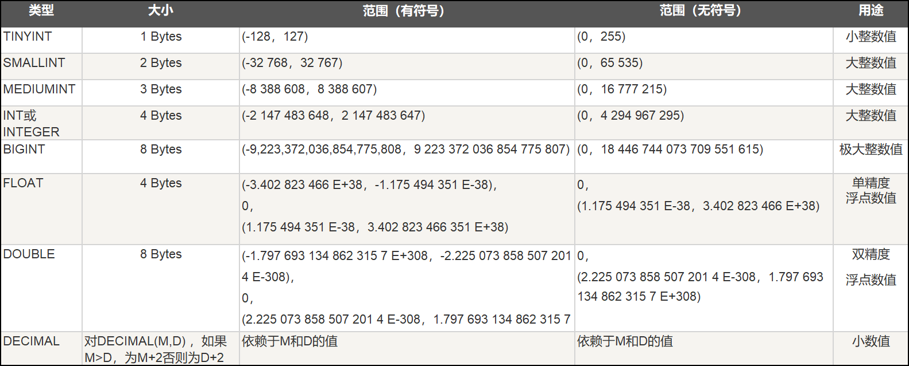
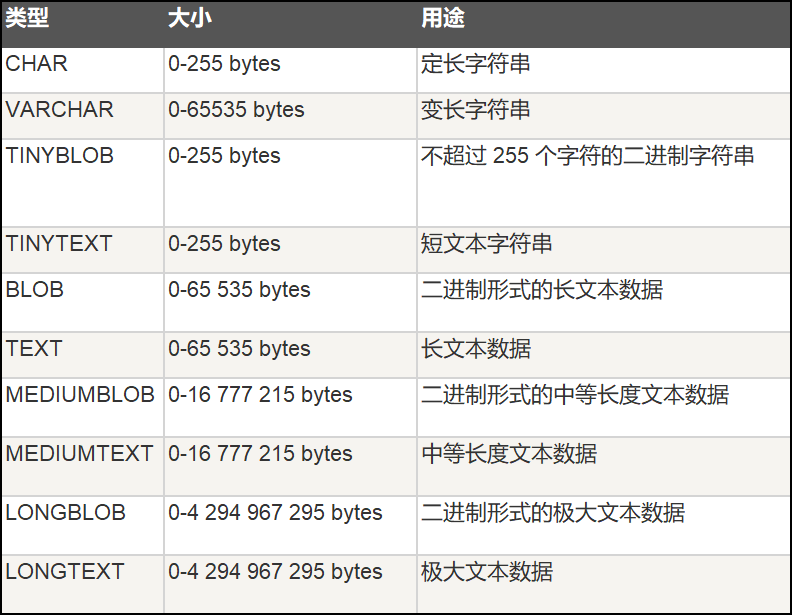
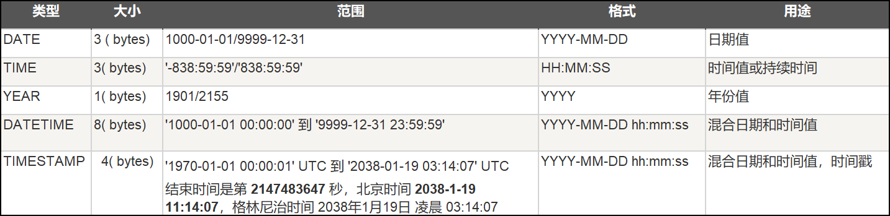
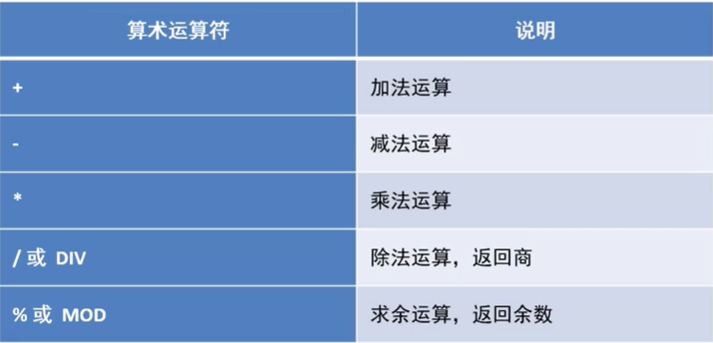
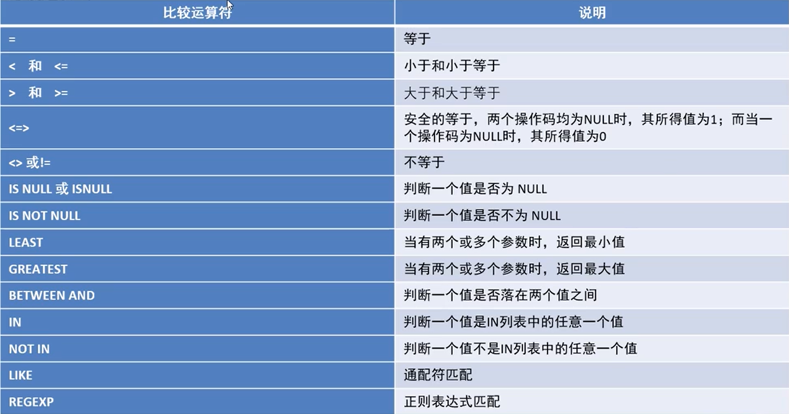
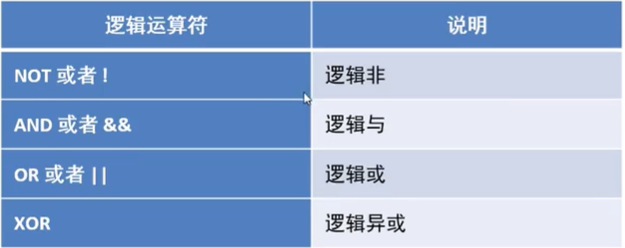
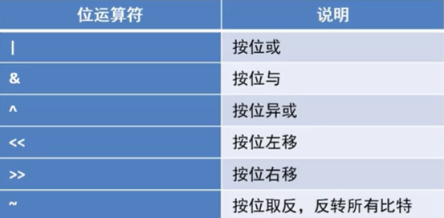
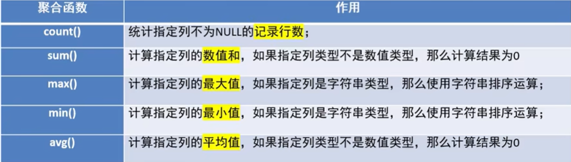

- [1. MySql 基本数据操作介绍](#1-mysql-基本数据操作介绍)
  - [1.1 数据查询语言 (DQL)](#11-数据查询语言-dql)
  - [1.2 数据操作语言 (DML)](#12-数据操作语言-dml)
  - [1.3 数据定义语言 (DDL)](#13-数据定义语言-ddl)
  - [1.4 数据控制语言 (DCL)](#14-数据控制语言-dcl)
  - [1.5 事务控制语言 (DQL)](#15-事务控制语言-dql)
- [2. 基本操作实例 \[1\]](#2-基本操作实例-1)
  - [2.1 DDL之操作数据库表](#21-ddl之操作数据库表)
    - [2.1.1 常用数据库操作](#211-常用数据库操作)
    - [2.1.2 表结构的常用操作](#212-表结构的常用操作)
    - [2.1.3 数据类型](#213-数据类型)
  - [2.2 DML之操作数据表](#22-dml之操作数据表)
    - [2.2.1 数据的常用操作](#221-数据的常用操作)
- [3. 基本操作实例 \[2\]](#3-基本操作实例-2)
  - [3.1 DQL之操作数据表](#31-dql之操作数据表)
    - [3.1.1 操作语法](#311-操作语法)
    - [3.1.2 数据准备](#312-数据准备)
    - [3.1.3 简单查询](#313-简单查询)
  - [3.2  DQL之运算符](#32--dql之运算符)
    - [3.2.1 运算符查询](#321-运算符查询)
  - [3.3  DQL之排序查询](#33--dql之排序查询)
    - [3.3.1 操作语法](#331-操作语法)
  - [3.4  DQL之聚合查询](#34--dql之聚合查询)
    - [3.4.1 聚合函数](#341-聚合函数)
    - [3.4.2 操作语法](#342-操作语法)
    - [3.4.3 处理null值](#343-处理null值)
  - [3.5  DQL之分组查询](#35--dql之分组查询)
    - [3.5.1 操作语法](#351-操作语法)
  - [3.6  DQL之分页查询](#36--dql之分页查询)
    - [3.6.1 操作语法](#361-操作语法)
  - [3.7  DQL之导入表](#37--dql之导入表)
    - [3.7.1 操作语法](#371-操作语法)


# 1. MySql 基本数据操作介绍
- Sql语言由五个部分组成：
1. 数据查询语言（Data Query Language, DQL）
2. 数据操作语言（Data Manipulation Language, DML）
3. 数据定义语言（Data Definition Language, DDL）
4. 数据控制语言（Data Control Language, DCL）
5. 事务控制语言（Transaction Control Language, TCL）

## 1.1 数据查询语言 (DQL)
>DQL主要用于数据的查询，其基本结构是使用SELECT子句，FROM子句和WHERE子句的组合来查询一条或多条数据。

## 1.2 数据操作语言 (DML)
>DML主要用于对数据库中的数据进行增加、修改和删除的操作。
1. INSERT：增加数据
2. UPDATE：修改数据
3. DELETE：删除数据

## 1.3 数据定义语言 (DDL)
>DDL主要用针对是数据库对象（数据库、表、索引、视图、触发器、存储过程、函数）进行创建、修改和删除操作。
1. CREATE：创建数据库对象
2. ALTER：修改数据库对象
3. DROP：删除数据库对象

## 1.4 数据控制语言 (DCL) 
> DCL用来授予或回收访问 数据库的权限
1. REVOKE：回收授予的某种权限
2. GRANT：授予用户某种权限

## 1.5 事务控制语言 (DQL)
> TCL用于数据库的事务管理。
1. START TRANSACTION：开启事务
2. COMMIT：提交事务
3. ROLLBACK：回滚事务
4. SET TRANSACTION：设置事务的属性 

# 2. 基本操作实例 [1]
## 2.1 DDL之操作数据库表
### 2.1.1 常用数据库操作
    ```
    # 1. 查看所有数据库
    SHOW DATABASES;

    # 2. 创建数据库
    CREATE DATABASE IF NOT EXISTS mydb1;

    # 3. 选择使用哪个数据库
    USE mydb1;

    # 4. 修改数据库编码
    ALTER DATABASE mydb1 CHARACTER SET utf8;

    # 5. 删除数据库
    DROP DATABASE IF EXISTS mydb1;
    ```

### 2.1.2 表结构的常用操作
    ```
    USE mydb1;
    
    # 1. 创建表
    CREATE TABLE IF NOT EXISTS student(
        sid INT,
        name VARCHAR(20),
        gender VARCHAR(20),
        age INT,
        birth DATE,
        address VARCHAR(20)
    );

    # 2. 查看当前数据库的所有表明称
    SHOW TABLES;

    # 3. 查看指定某个表的创语句
    SHOW CREATE TABLE student;
    
    # 4. 查看表结构
    DESC student;
    
    # 5. 删除表
    DROP TABLE student;

    # 6. 修改表结构
    
    # 添加列格式：alter table 表明 add 列名 类型(长度) [约束];
    ALTER TABLE student ADD dept VARCHAR(20);
    
    # 修改类格式：alter table 表明 change 旧列名 新列名 类型(长度) [约束];
    ALTER TABLE student change dept department VARCHAR(30);

    # 修改表明格式：rename table 表名 to 新表名;
    RENAME TABLE student to stu;
    ```
### 2.1.3 数据类型
  
  > 无符号表示 (unsigned)

- 字符串类型
  

- 日期和时间类型
  

## 2.2 DML之操作数据表

### 2.2.1 数据的常用操作
    ```
    # 1. 插入数据
    # 格式1  insert into 表 (列名1,列名2,列名3...) values (值1,值2,值3...);
    INSERT INTO student(sid,name,gender,age,birth,address)
                            VALUES (1001,'张三','男',18,'2020,10,10','北京');

    INSERT INTO student(sid,name,gender,age,birth,address)
                            VALUES (1002,'王四','男',18,'2020,1,12','上海'),
                                   (1003,'李五','女',30,'2000,5,8','广州');

    #格式2 inser into 表 values (值1,值2,值3...);  // 表中插入所有列
    INSERT INTO student VALUES (1004,'六六','男',40,'1999,3,1','北京','人事');

    INSERT INTO student VALUES (1005,'陈工','男',25,'2002,8,1','深圳','技术'),
							   (1006,'小美','男',19,'2005,9,15','北京','人事');

    
    # 2. 修改数据
    # 格式1：update 表名 set 字段名=值,字段名=值 ...;
    # 格式2：update 表名 set 字段名=值,字段名=值 ... where 条件;
    
    # 所有学生地址修改
    UPDATE student set address = '重庆';

    # 指定id修改
    UPDATE student set address = '北京' WHERE sid = 1004;
    UPDATE student set address = '上海' WHERE sid > 1004;
    UPDATE student set address = '广州', department = '工程师' WHERE sid = 1001;
    
    # 3. 删除数据
    # 指定id
    DELETE FROM student WHERE sid > 1004;

    # 删除表所有数据
    DELETE FROM student;

    # 清空表数据后重建表
    TRUNCATE TABLE student;
    ```

# 3. 基本操作实例 [2]
## 3.1 DQL之操作数据表
### 3.1.1 操作语法
  ```
  /* 语法格式
  SELECT
    [all distinct]
    <目标列的表达1> [别名],
    <目标列的表达2> [别名]...
  FROM <表名或视图名> [别名],  <表名或视图名> [别名]...
  [WHERE <条件表达>]
  [GROUP BY <列名>
    [HAVING <条件表达式>]
  ]
  [ORDER BY <列名> [ASC | DESC]
  ]
  [LIMIT <数字或列表>];
  */
    
  # 简化版语法
  # SELECT *| 列名 FROM 表 WHERE 条件;
  ```
### 3.1.2 数据准备
  ```
  # 创建数据库
  CREATE DATABASE IF NOT EXISTS mydb2;
  USE mydb2;

  # 创建商品表
  CREATE TABLE product(
    # 商品编号
    pid INT PRIMARY KEY auto_increment, 
    # 商品名称
    pname VARCHAR(20) NOT NULL,		
    # 商品价格			
    price DOUBLE,		
    # 商品所属分类										
    category_id VARCHAR(20)							
  );

  # 添加数据
  INSERT INTO product VALUES(NULL,'海尔洗衣机',5000,'c001');
  INSERT INTO product VALUES(NULL,'美的冰箱',3000,'c001');
  INSERT INTO product VALUES(NULL,'格力空调',5000,'c001');
  INSERT INTO product VALUES(NULL,'九阳电饭煲',5000,'c001');

  INSERT INTO product VALUES(NULL,'啄木鸟衬衣',300,'c002');
  INSERT INTO product VALUES(NULL,'桓源祥西裤',800,'c002');
  INSERT INTO product VALUES(NULL,'花花公子夹克',440,'c002');
  INSERT INTO product VALUES(NULL,'劲霸休闲裤',266,'c002');
  INSERT INTO product VALUES(NULL,'海澜之家卫衣',180,'c002');
  INSERT INTO product VALUES(NULL,'杰克琼斯运动裤',430,'c002');

  INSERT INTO product VALUES(NULL,'兰蔻面霜',300,'c003');
  INSERT INTO product VALUES(NULL,'雅诗兰黛精华水',200,'c003');
  INSERT INTO product VALUES(NULL,'香奈儿香水',350,'c003');
  INSERT INTO product VALUES(NULL,'SKT-II神仙水',350,'c003');
  INSERT INTO product VALUES(NULL,'资生堂粉底液',180,'c003');

  INSERT INTO product VALUES(NULL,'老北京方便面',56,'c004');
  INSERT INTO product VALUES(NULL,'良品铺子海带丝',17,'c004');
  INSERT INTO product VALUES(NULL,'三只松鼠坚果',88,NULL);
  ```
### 3.1.3 简单查询
  ```
  # 查询所有的商品
  SELECT * FROM product;
  # 查询商品名和商品价格
  SELECT pname,price FROM product;
  # 表别名
  SELECT * FROM product as p;
  # 列别名
  SELECT pname as pn FROM product;
  # 去除重复值
  SELECT DISTINCT price FROM product;
  # 运算查询结果
  SELECT pname, price + 10 as p10 FROM product;
  ```
## 3.2  DQL之运算符
  - 算术用算符
    
  - 比较运算符
    
  - 逻辑运算符
    
  - 位运算符
    
  
### 3.2.1 运算符查询
  ```
  # 算术运算符
  SELECT 6 + 2;
  SELECT 6 - 2;
  SELECT 6 * 2;
  SELECT 6 / 2;
  SELECT 6 % 2;

  # 将所有商品的价格加5元
  SELECT pname, price + 5 as new_price FROM product;
  # 将所有商品价格上涨5%
  SELECT pname, price * 1.05 as new_price FROM product;

  # 查询商品名称为"海尔洗衣机"的商品所有信息
  SELECT * FROM product WHERE pname = '海尔洗衣机';

  # 查询价格为800商品
  SELECT * FROM product WHERE price = 800;

  # 查询价格不是800的所有商品
  SELECT * FROM product WHERE price != 800;
  SELECT * FROM product WHERE price <> 800;
  SELECT * FROM product WHERE not (price = 800);

  # 查询商品价格大于60的所有商品信息
  SELECT * FROM product WHERE price > 60;

  # 查询价格在200~1000之间的所有商品
  SELECT * FROM product WHERE price >= 200 and price <=1000;
  SELECT * FROM product WHERE price BETWEEN 200 AND 1000;

  # 查讯商品价格是200或800的所有商品
  SELECT * FROM product WHERE price IN (200, 800);
  SELECT * FROM product WHERE price = 200 OR price = 800;
  SELECT * FROM product WHERE price = 200 || price = 800;

  # 查询含有'裤'字的所有商品(%用来匹配任意字符)
  SELECT * FROM product WHERE pname LIKE '%裤%';

  # 查询以'海'开头的所有商品
  SELECT * FROM product WHERE pname LIKE '海%';

  # 查询第二个字为'蔻'的所有商品 (_下划线匹配单个字符)
  SELECT * FROM product WHERE pname LIKE '_蔻%';
  
  # 查询category_id为null的商品
  SELECT * FROM product WHERE category_id IS NULL;

  # 查询category_id不为null分类的商品
  SELECT * FROM product WHERE category_id IS NOT NULL;

  # 使用least求最小值 (如果值有null,不会进行比较，结果返回null)
  SELECT LEAST(10,5,20) as small_number;
  SELECT LEAST(10,NULL,20) as small_number;

  # 使用greatest求最大值 (如果值有null,不会进行比较，结果返回null)
  SELECT GREATEST(10,20,30) as big_number;
  SELECT GREATEST(10,NULL,30) as big_number;

  # 位运算符
  # 与
  SELECT 3 & 5;
  # 或
  SELECT 3 | 5;
  # 异或
  SELECT 3 ^ 5;
  # 左移
  SELECT 3 << 1;
  # 右移
  SELECT 3 >> 1;
  # 取反
  SELECT ~3;
  ```
## 3.3  DQL之排序查询
### 3.3.1 操作语法
```
# select 字段1, 字段2, ...  from 表名 order by 字段名1 [asc|desc], 字段名2 [asc|desc]

# 1. 使用价格排序 (降序)
SELECT * FROM product ORDER BY price DESC;

# 2. 在价格排序(降序)的基础上，以分类排序(升序)
SELECT * FROM product ORDER BY price DESC, category_id ASC;

# 3. 显示商品的价格(去重复)，并排序(降序)
SELECT DISTINCT price FROM product ORDER BY price DESC;
```

## 3.4  DQL之聚合查询
### 3.4.1 聚合函数

### 3.4.2 操作语法
```
# 1. 查询商品的总条数
SELECT COUNT(pid) FROM product;
SELECT COUNT(*) FROM product;

# 2. 查询价格大于200商品的总条数
SELECT COUNT(pid) FROM product WHERE price > 200; 

# 3. 查询分类为'c001'的所有商品的总和
SELECT SUM(price) FROM product WHERE category_id = 'c001';

# 4. 查询商品的最大价格
SELECT MAX(price) FROM product;

# 5. 查询商品的最小价格
SELECT MIN(price) FROM product;

SELECT MAX(price) max_price, MIN(price) min_price FROM product;

# 6. 查询分类为'c002'所有商品的平均价格
SELECT AVG(price) FROM product WHERE category_id = 'c002';
```
### 3.4.3 处理null值
- 直接忽略null不存在
```
# 创建表
CREATE TABLE test_null(
	c1 VARCHAR(20),
	c2 INT
);

# 插入数据
INSERT INTO test_null VALUES('aaa', 3);
INSERT INTO test_null VALUES('bbb', 3);
INSERT INTO test_null VALUES('ccc', NULL);
INSERT INTO test_null VALUES('ddd', 6);

# 测试
SELECT COUNT(*), COUNT(1), COUNT(c2) FROM test_null;
SELECT SUM(c2), MAX(c2), MIN(c2), AVG(c2) FROM test_null;
```
## 3.5  DQL之分组查询
### 3.5.1 操作语法
```
# 格式：select 字段1, 字段2 ... from 表名 group by 分组字段 having 分组条件;

# 1. 统计各个分类商品的个数
SELECT category_id, COUNT(*) FROM product GROUP BY category_id;

# 2. 统计各个分类商品的个数，且只选是个数大于4的信息
SELECT
	category_id,
	COUNT(*) cnt 
FROM
	product 
GROUP BY
	category_id 
HAVING
	cnt > 4 
ORDER BY
	cnt;
```
## 3.6  DQL之分页查询
### 3.6.1 操作语法
```
# 1. 查询product表的前5条记录
SELECT * FROM product LIMIT 5;

# 2. 从第4条开始显示，显示5条
SELECT * FROM product LIMIT 3,5;

# 3. 分页显示
SELECT * FROM product LIMIT 0, 3;  # 第1页 ---> (1-1)*3
SELECT * FROM product LIMIT 3, 3;  # 第2页 ---> (2-1)*3
SELECT * FROM product LIMIT 6, 3;  # 第3页 ---> (3-1)*3
SELECT * FROM product LIMIT (n-1)*3, 3;  # 第n页 ---> (n-1)*3
```
## 3.7  DQL之导入表
### 3.7.1 操作语法
- 将一张表的数据导入到另一张表中，采用insert into select语句
```
# 格式1：insert into Table2(field1, field2, ...) select value1, value2, ... from TABLE
# 格式2：insert into Table2 select * from Table1

CREATE TABLE product2(
	pname VARCHAR(20),
	price DOUBLE
);

INSERT INTO product2(pname, price) SELECT pname, price FROM product;
SELECT * FROM product2;

CREATE TABLE product3(
	category_id VARCHAR(20),
	product_count INT
);

INSERT INTO product3 SELECT category_id, COUNT(*) FROM product GROUP BY category_id;
SELECT * FROM product3;
```