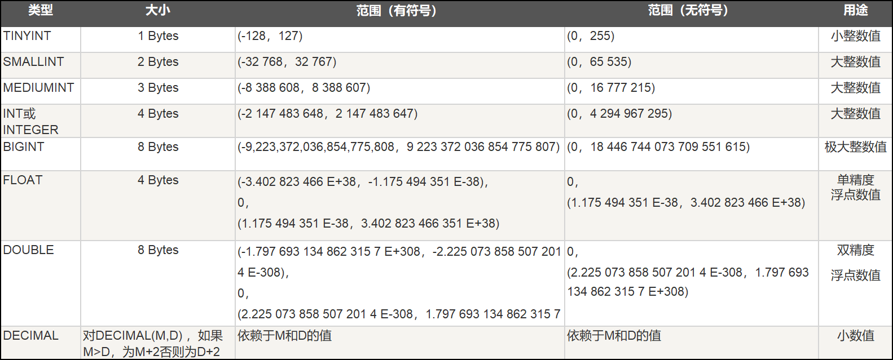
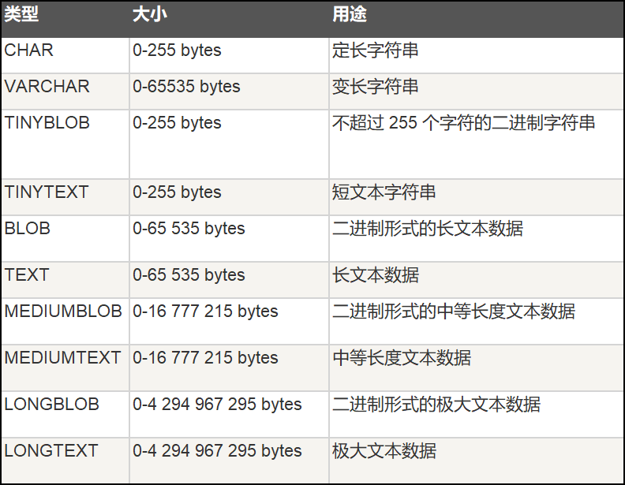
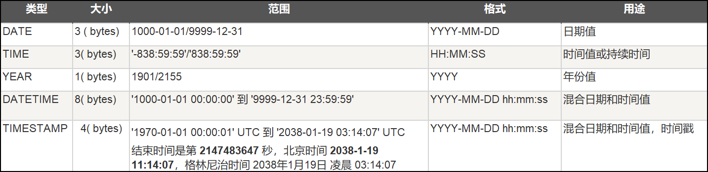

- [1. MySql 基本数据操作介绍](#1-mysql-基本数据操作介绍)
  - [1.1 数据查询语言 (DQL)](#11-数据查询语言-dql)
  - [1.2 数据操作语言 (DML)](#12-数据操作语言-dml)
  - [1.3 数据定义语言 (DDL)](#13-数据定义语言-ddl)
  - [1.4 数据控制语言 (DCL)](#14-数据控制语言-dcl)
  - [1.5 事务控制语言 (DQL)](#15-事务控制语言-dql)
- [2. 基本实例操作](#2-基本实例操作)
  - [2.1 DDL操作之数据库操作](#21-ddl操作之数据库操作)


# 1. MySql 基本数据操作介绍
- Sql语言由五个部分组成：
1. 数据查询语言（Data Query Language, DQL）
2. 数据操作语言（Data Manipulation Language, DML）
3. 数据定义语言（Data Definition Language, DDL）
4. 数据控制语言（Data Control Language, DCL）
5. 事务控制语言（Transaction Control Language, TCL）

## 1.1 数据查询语言 (DQL)
>DQL主要用于数据的查询，其基本结构是使用SELECT子句，FROM子句和WHERE子句的组合来查询一条或多条数据。

## 1.2 数据操作语言 (DML)
>DML主要用于对数据库中的数据进行增加、修改和删除的操作。
1. INSERT：增加数据
2. UPDATE：修改数据
3. DELETE：删除数据

## 1.3 数据定义语言 (DDL)
>DDL主要用针对是数据库对象（数据库、表、索引、视图、触发器、存储过程、函数）进行创建、修改和删除操作。
1. CREATE：创建数据库对象
2. ALTER：修改数据库对象
3. DROP：删除数据库对象

## 1.4 数据控制语言 (DCL) 
> DCL用来授予或回收访问 数据库的权限
1. REVOKE：回收授予的某种权限
2. GRANT：授予用户某种权限

## 1.5 事务控制语言 (DQL)
> TCL用于数据库的事务管理。
1. START TRANSACTION：开启事务
2. COMMIT：提交事务
3. ROLLBACK：回滚事务
4. SET TRANSACTION：设置事务的属性 

# 2. 基本实例操作
## 2.1 DDL操作之数据库操作
- 常用数据库操作
    ```
    # 查看所有数据库
    SHOW DATABASES;

    # 创建数据库
    CREATE DATABASE IF NOT EXISTS mydb1;

    # 选择使用哪个数据库
    USE mydb1;

    # 修改数据库编码
    ALTER DATABASE mydb1 CHARACTER SET utf8;

    # 删除数据库
    DROP DATABASE IF EXISTS mydb1;
    ```

- 表结构的常用操作
    ```
    USE mydb1;
    
    # 创建表
    CREATE TABLE IF NOT EXISTS student(
        sid INT,
        name VARCHAR(20),
        gender VARCHAR(20),
        age INT,
        birth DATE,
        address VARCHAR(20)
    );

    # 查看当前数据库的所有表明称
    SHOW TABLES;

    # 查看指定某个表的创语句
    SHOW CREATE TABLE student;
    
    # 查看表结构
    DESC student;
    
    # 删除表
    DROP TABLE student;

    # 修改表结构
    
    # 添加列格式：alter table 表明 add 列名 类型(长度) [约束];
    ALTER TABLE student ADD dept VARCHAR(20);
    
    # 修改类格式：alter table 表明 change 旧列名 新列名 类型(长度) [约束];
    ALTER TABLE student change dept department VARCHAR(30);

    # 修改表明格式：rename table 表名 to 新表名;
    RENAME TABLE student to stu;
    ```
- 数据类型
  
  > 无符号表示 (unsigned)

- 字符串类型
  

- 日期和时间类型
  
